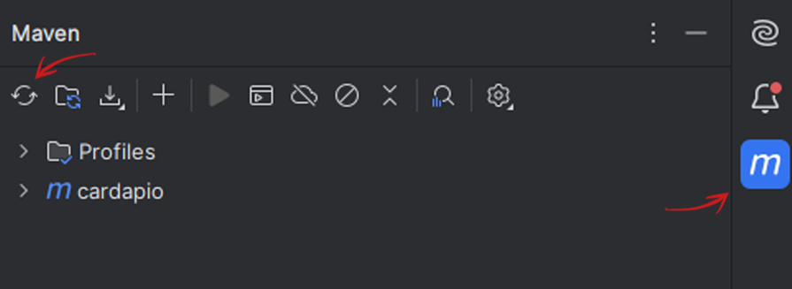
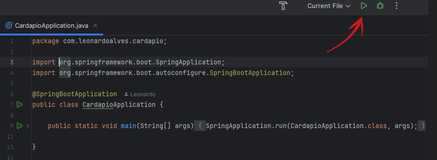

# Cardápio Digital - API - Backend

Esta aplicação foi desenvolvida com Java Spring, utilizando Spring MVC para a criação do servidor, Spring Data JPA para a manipulação e persistência de dados, Lombok para reduzir código repetitivo e o Postgres Driver para a conexão com o banco de dados PostgreSQL.

# 💻 Requisitos
• Versão do Java compatível instalado em sua máquina  
• Banco de dados PostgreSQL instalado e configurado  
• Maven instalado  
• IDE compatível  

# ⬇️ Instalação do Projeto
## Primeiro você deve clonar o repositório

```bash
## Clone o repositório
git clone https://github.com/LeoAlves02/cardapio-api

## Acesse-o
cd cardapio-api
```
 Agora, dentro do IntelliJ, instale as depedências com o Maven  


 Por fim, abra o arquivo da classe CardapioApplication para executar o projeto.  


# 👩‍💻 Integração com o Front-end
Para integrar com o frontend, você pode clonar o projeto e rodá-lo localmente ou, caso prefira, desenvolver suas próprias implementações seguindo as diretrizes do projeto.

## 🌐 Link do Repositório 

Este é o repositório do meu projeto Front-end. Você pode visitar o [repositório no GitHub](https://github.com/LeoAlves02/cardapio-frontend).
